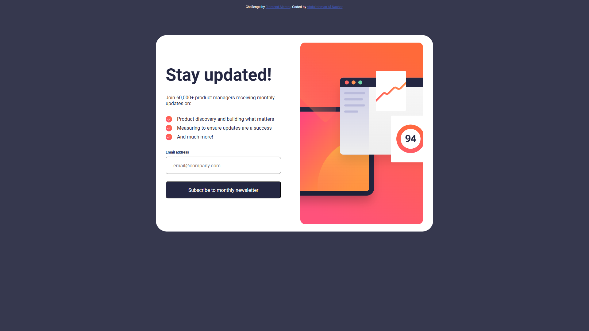
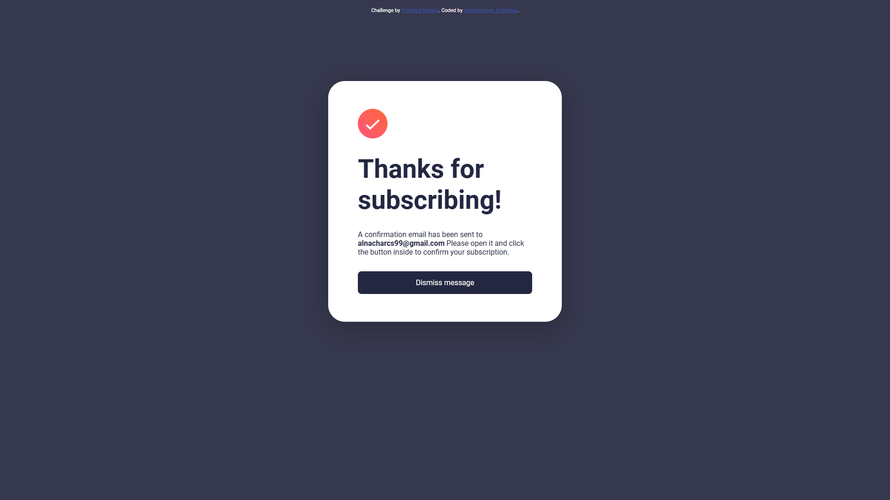

# Frontend Mentor - Newsletter Sign-up Form with Success Message

This is my solution to the [Newsletter sign-up form with success message challenge on Frontend Mentor](https://www.frontendmentor.io/challenges/newsletter-signup-form-with-success-message-3FC1AZbNrv).

## Table of contents

- [Overview](#overview)
  - [The challenge](#the-challenge)
  - [Screenshot](#screenshot)
  - [Links](#links)
- [My process](#my-process)
  - [Built with](#built-with)
  - [What I learned](#what-i-learned)
  - [Continued development](#continued-development)
- [Author](#author)

## Overview

### The challenge

Users should be able to:

- Add their email and submit the form
- See a success message with their email after successfully submitting the form
- See form validation messages if:
  - The field is left empty
  - The email address is not formatted correctly
- View the optimal layout for the interface depending on their device's screen size
- See hover and focus states for all interactive elements on the page

### Screenshot

### Links

- Solution URL: [GitHub Repository](https://github.com/nachar99/newsletter-sign-up-with-success-message)
- Live Site URL: [Live Demo](https://nachar99.github.io/newsletter-sign-up-with-success-message/)

## My process

### Built with

- Semantic HTML5 markup
- CSS custom properties
- Flexbox
- CSS Grid
- Mobile-first workflow
- JavaScript form validation
- LocalStorage for email persistence

### What I learned

While building this project, I gained valuable experience in:

1. **Form Validation**: Implementing real-time email validation with regex pattern matching

function validateEmail(email) {
if( /(.+)@(.+){2,}\.(.+){2,}/.test(email) ){
localStorage.setItem("validEmail", email);
window.location.href = "success.html";
} else {
span.innerHTML = 'Valid email required';
emailInput.style.backgroundColor = "var(--colors-red-100, #FFE7E6)";
emailInput.style.border = "1px solid var(--colors-red, #FF6155)";
}
}

2.**State Management**: Using localStorage to persist the user's email between pages

// Storing email
localStorage.setItem("validEmail", email);

// Retrieving email
let validEmail = localStorage.getItem("validEmail");

3.**Responsive Design:** Creating layouts that adapt to different screen sizes using CSS Grid and Flexbox
#left-side {
height: 100%;
width: 440px;
padding-right: 64px;
padding-top: 71.5px;
padding-bottom: 71.5px;
display: flex;
flex-direction: column;
gap: 32px;
}

## Areas I'd like to continue improving:

Advanced form validation with more specific error messages

Implementing a mobile-first approach more consistently

Adding animations for smoother transitions between states

Exploring CSS frameworks to streamline development

## Author

- Website - [Abdulrahman Al-Nachar](https://github.com/nachar99)
- Frontend Mentor - [@nachar99](https://www.frontendmentor.io/profile/nachar99)
